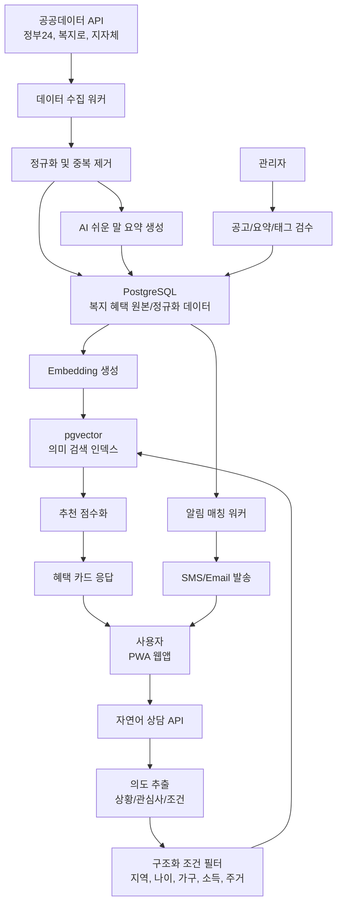
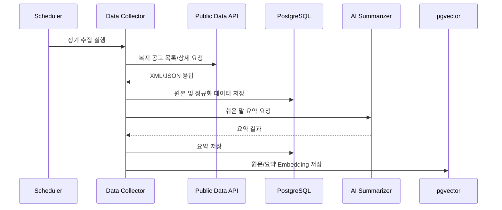
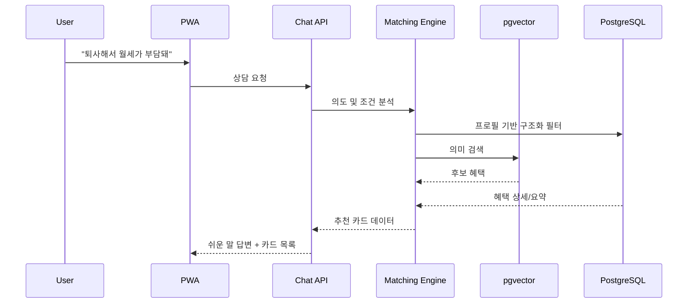
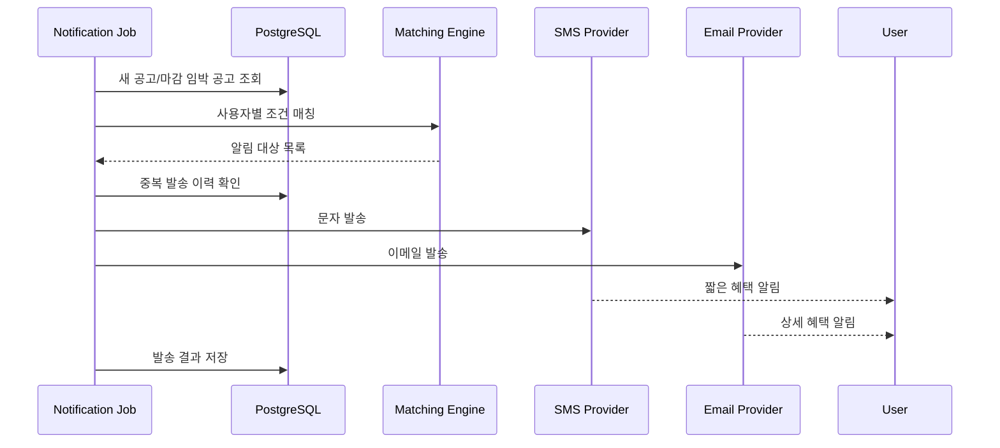

# [시스템 아키텍처 및 UI 설계] Architecture

## 1. 제품 아키텍처 방향

WelfareFit은 사용자가 어려운 행정 용어를 몰라도 자연어로 자신의 상황을 말하면, 받을 가능성이 있는 복지 혜택을 쉬운 말로 설명하고 문자/이메일로 먼저 알려주는 PWA 기반 복지 상담 앱이다.

이 앱의 핵심은 검색창이 아니라 다음 세 가지 경험이다.

* **말하듯 묻기:** "퇴사해서 월세가 부담돼"처럼 생활 언어로 질문한다.
* **카드로 바로 이해하기:** 추천 혜택을 짧고 선명한 카드로 확인한다.
* **놓치기 전에 알림받기:** 새 혜택이나 마감 임박 혜택을 문자/이메일로 받는다.

## 2. 추천하는 전체 구조



## 3. 애플리케이션 계층

### 3.1. PWA 프론트엔드

* **역할:** 사용자가 자연어로 상담하고, 추천 혜택을 카드로 보고, 관심 혜택을 저장하고, 알림을 설정하는 화면을 제공한다.
* **권장 기술:** Next.js, TypeScript, Tailwind CSS
* **핵심 화면:**
    * 온보딩
    * 홈 피드
    * 자연어 상담
    * 추천 혜택 카드 목록
    * 혜택 상세
    * 저장한 혜택
    * 알림 설정
    * 관리자 검수

### 3.2. API 서버

* **역할:** 프론트엔드 요청을 받아 사용자 프로필, 상담, 추천, 저장, 알림 설정을 처리한다.
* **주요 API:**
    * `POST /api/onboarding`
    * `GET /api/profile`
    * `PATCH /api/profile`
    * `POST /api/chat`
    * `GET /api/benefits`
    * `GET /api/benefits/:id`
    * `POST /api/benefits/:id/save`
    * `PATCH /api/notifications/settings`
    * `POST /api/admin/benefits/:id/review`

### 3.3. 데이터 수집 워커

* **역할:** 공공 복지 데이터를 정기적으로 가져와 내부 DB에 저장한다.
* **원칙:** 사용자 질문 시점에 외부 공공 API를 직접 호출하지 않는다.
* **처리 단계:**
    * 데이터 소스별 API 호출
    * 원본 응답 저장
    * 필드 정규화
    * 중복 제거
    * 변경 감지
    * 쉬운 말 요약 작업 큐 등록

### 3.4. AI 상담 및 요약 모듈

* **상담 모듈:** 사용자 질문에서 생활 상황, 감정, 지원 필요 영역, 추가 확인 조건을 추출한다.
* **요약 모듈:** 복지 공고 원문을 쉬운 말 요약으로 변환한다.
* **안전 원칙:** 수급 가능성을 확정하지 않고, "신청 가능성이 높아요", "이 조건은 확인이 필요해요"처럼 표현한다.

### 3.5. 알림 워커

* **역할:** 사용자의 조건과 새 복지 혜택을 비교해 문자 또는 이메일 알림을 발송한다.
* **알림 조건:**
    * 새 맞춤 혜택
    * 마감 임박 혜택
    * 저장한 혜택 변경
    * 프로필 보완 필요
* **중복 방지:** 같은 사용자에게 같은 혜택을 반복 발송하지 않도록 발송 이력을 기준으로 제어한다.

## 4. 데이터 흐름

### 4.1. 복지 공고 수집 흐름



### 4.2. 자연어 상담 흐름



### 4.3. 알림 흐름



## 5. 핵심 데이터 모델

### 5.1. 사용자

| 필드 | 설명 |
| --- | --- |
| `id` | 사용자 ID |
| `birth_year` | 출생년도 |
| `region_sido` | 시/도 |
| `region_sigungu` | 시/군/구 |
| `current_status` | 학생, 구직자, 직장인, 소상공인 등 |
| `household_type` | 1인 가구, 부부, 자녀 있음, 부모 부양 등 |
| `income_band` | 소득 없음, 낮음, 중간, 잘 모르겠음 등 |
| `housing_type` | 월세, 전세, 자가, 임시 거주 등 |
| `employment_detail` | 최근 실직, 휴직, 폐업, 일용직 등 |
| `interests` | 생계비, 주거비, 의료비, 청년, 육아 등 |
| `special_conditions` | 임신, 장애, 질병, 한부모, 재난 피해 등 |

### 5.2. 복지 혜택

| 필드 | 설명 |
| --- | --- |
| `id` | 혜택 ID |
| `source` | 데이터 출처 |
| `title` | 혜택명 |
| `provider` | 제공 기관 |
| `region_scope` | 전국/지역 |
| `target_summary` | 신청 대상 요약 |
| `benefit_summary` | 받을 수 있는 지원 |
| `plain_summary` | 쉬운 말 한 줄 요약 |
| `requirements` | 신청 조건 |
| `documents` | 준비 서류 |
| `apply_url` | 신청 링크 |
| `deadline` | 신청 마감일 |
| `raw_content` | 원문 |
| `review_status` | AI 요약 검수 상태 |

### 5.3. 알림

| 필드 | 설명 |
| --- | --- |
| `id` | 알림 ID |
| `user_id` | 사용자 ID |
| `benefit_id` | 혜택 ID |
| `channel` | SMS 또는 Email |
| `type` | 새 혜택, 마감 임박, 변경 알림 |
| `status` | 대기, 성공, 실패, 수신 거부 |
| `sent_at` | 발송 시각 |
| `failure_reason` | 실패 사유 |

## 6. 추천 엔진 설계

추천 엔진은 AI가 모든 것을 판단하게 만들지 않고, 구조화 조건과 벡터 검색을 함께 사용한다.

```text
최종 추천 점수 =
지역 일치 점수
+ 연령 조건 점수
+ 현재 상태 점수
+ 가구/소득/주거 조건 점수
+ 신청 기간 점수
+ 자연어 질문과의 의미 유사도
+ 사용자 관심 분야 점수
```

추천 결과는 다음 세 단계로 표현한다.

* **가능성 높음:** 사용자의 주요 조건과 혜택 조건이 대부분 일치한다.
* **확인 필요:** 일부 조건이 부족하거나 소득/가구 정보 확인이 필요하다.
* **가능성 낮음:** 지역, 연령, 상태 등 핵심 조건이 맞지 않는다.

## 7. MZ세대 친화 카드형 UI 방향

### 7.1. 디자인 컨셉

**컨셉명:** Calm Pop Welfare

복지 서비스는 신뢰감이 중요하지만, 기존 공공기관 UI처럼 딱딱하면 사용자가 머무르기 어렵다. 따라서 전체 톤은 차분하게 유지하되, 혜택 카드는 모바일 금융앱이나 라이프스타일 앱처럼 빠르게 훑고 저장할 수 있는 형태로 설계한다.

* 배경은 밝고 깨끗하게 유지한다.
* 카드는 흰색/옅은 회색 기반에 또렷한 컬러 태그를 사용한다.
* 상태별 색은 직관적으로 구분한다.
* 어려운 설명보다 "지금 나에게 왜 추천됐는지"를 먼저 보여준다.
* CTA는 신청, 저장, 알림받기처럼 행동 중심으로 배치한다.

### 7.2. 화면 구성

```text
[상단]
오늘 나에게 맞는 혜택
검색창/상담 입력: "지금 어떤 상황인가요?"

[추천 요약]
가능성 높은 혜택 3개
확인 필요 혜택 5개
마감 임박 혜택 2개

[카드 피드]
혜택 카드
혜택 카드
혜택 카드

[하단 탭]
홈 / 상담 / 저장 / 알림 / 내 정보
```

### 7.3. 혜택 카드 구조

```text
┌─────────────────────────────┐
│ 가능성 높음 · 서울 청년      │
│ 청년 월세 지원               │
│ 월세 부담이 큰 청년에게      │
│ 매달 일부 주거비를 지원해요. │
│                              │
│ 받을 수 있는 것              │
│ 최대 월 20만원 지원          │
│                              │
│ 왜 추천됐나요?               │
│ 서울 거주 + 청년 + 월세 조건 │
│                              │
│ [자세히 보기] [저장] [알림]  │
└─────────────────────────────┘
```

### 7.4. 카드 정보 우선순위

카드는 행정 문서 순서가 아니라 사용자가 궁금해하는 순서로 보여준다.

1. 내가 받을 가능성이 있는지
2. 무엇을 받을 수 있는지
3. 왜 추천됐는지
4. 언제까지 신청해야 하는지
5. 어떻게 신청하는지
6. 어떤 서류가 필요한지
7. 원문은 어디서 볼 수 있는지

### 7.5. 상태별 카드 스타일

| 상태 | 의미 | UI 표현 |
| --- | --- | --- |
| 가능성 높음 | 주요 조건이 대부분 일치 | 밝은 그린 태그, 상단 우선 노출 |
| 확인 필요 | 추가 조건 확인 필요 | 옐로우 태그, 부족한 정보 표시 |
| 마감 임박 | 신청 기한이 가까움 | 레드/코랄 태그, D-day 강조 |
| 저장됨 | 사용자가 관심 표시 | 북마크 아이콘 활성화 |
| 새 혜택 | 최근 수집된 혜택 | 블루 태그, "NEW" 표시 |

### 7.6. 상담 답변 UI

채팅 답변은 긴 문단보다 "짧은 답변 + 카드 묶음"으로 구성한다.

```text
사용자:
이번 달에 퇴사해서 월세가 부담돼

앱:
지금 상황이면 생계비와 주거비 지원을 먼저 확인해보는 게 좋아요.
신청 가능성이 있는 혜택을 3개 찾았어요.

[긴급복지 생계지원 카드]
[주거급여 카드]
[청년월세지원 카드]

더 정확히 보려면 지금 거주 중인 지역과 가구원 수를 알려주세요.
```

## 8. UI 스타일 가이드

### 8.1. 컬러

* **Base:** Warm White `#FAFAF7`
* **Text:** Deep Charcoal `#202124`
* **Sub Text:** Cool Gray `#6B7280`
* **Primary:** Fresh Green `#18A058`
* **Info:** Sky Blue `#2F80ED`
* **Warning:** Soft Yellow `#F2C94C`
* **Urgent:** Coral Red `#EB5757`

### 8.2. 타이포그래피

* 모바일 기준 본문은 16px 이상을 기본으로 한다.
* 카드 제목은 굵고 짧게, 설명은 2줄 안에서 끝낸다.
* 행정 용어는 본문 안에 그대로 두지 말고 용어 풀이 칩으로 분리한다.

### 8.3. 인터랙션

* 카드를 누르면 상세 화면으로 자연스럽게 확장된다.
* 저장 버튼은 즉시 피드백을 준다.
* 알림 버튼은 문자/이메일 채널 선택으로 이어진다.
* 상담 입력창은 항상 하단에 고정해 사용자가 다시 질문하기 쉽게 한다.
* 추천 이유는 펼쳐보기로 제공해 카드가 복잡해지지 않게 한다.

## 9. 접근성과 신뢰 설계

복지 앱은 세련된 UI보다 신뢰와 이해가 우선이다. 따라서 디자인은 예쁘게 보이는 것보다 사용자가 실수 없이 판단할 수 있게 만드는 쪽을 우선한다.

* 버튼과 카드 터치 영역은 충분히 크게 만든다.
* 상태 색상만으로 의미를 전달하지 않고 텍스트 라벨을 함께 사용한다.
* 신청 가능성을 확정적으로 말하지 않는다.
* "정부 원문 보기"를 항상 제공한다.
* AI 요약에는 기준일을 표시한다.
* 사용자가 입력한 민감정보가 왜 필요한지 짧게 설명한다.

## 10. MVP 화면 우선순위

1. 온보딩/프로필 입력
2. 홈 추천 카드 피드
3. 자연어 상담 화면
4. 혜택 상세 화면
5. 저장한 혜택
6. 알림 설정
7. 관리자 검수 화면

## 11. 구현 우선순위

1. 데이터 모델과 DB 구성
2. 복지 공고 수집/정규화
3. 쉬운 말 요약 생성
4. 사용자 프로필 입력
5. 구조화 조건 기반 추천
6. 자연어 상담 + 벡터 검색
7. 카드형 UI
8. 문자/이메일 알림
9. 관리자 검수

## 12. 최종 추천

초기 버전은 "AI 챗봇"을 전면에 내세우기보다, **홈 카드 피드 + 상담 입력창** 구조로 만드는 것이 좋다. 사용자는 앱을 열자마자 자신에게 맞는 혜택 카드를 보고, 더 궁금한 내용이 있을 때 자연어로 물어볼 수 있다.

이 방식은 다음 장점이 있다.

* 복지 혜택을 빠르게 훑을 수 있다.
* AI 답변이 길어져도 카드가 핵심 정보를 잡아준다.
* 문자/이메일 알림에서 앱 상세 카드로 자연스럽게 연결된다.
* MZ세대에게 익숙한 피드형 경험과 정보 취약계층에게 필요한 쉬운 설명을 동시에 만족시킨다.
