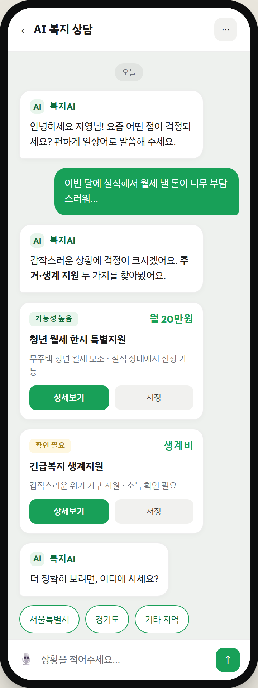
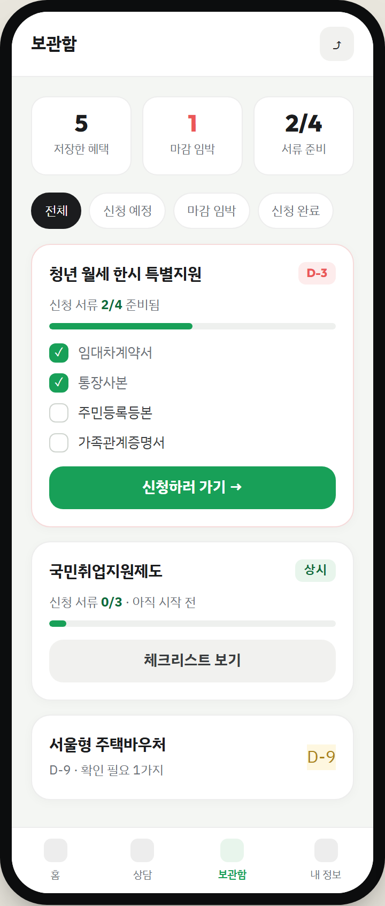
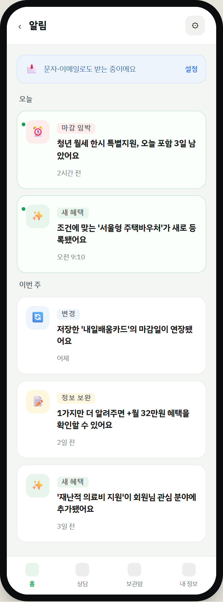
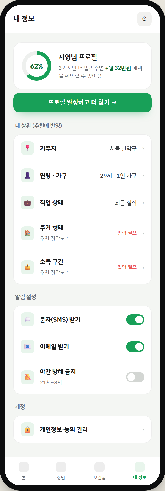

# 복지AI · 메뉴별 역할 & 화면 명세

> 플랫폼: 모바일 PWA (360×780 기준) · 디자인 시스템: [home-screen.md](home-screen.md)와 동일 토큰
> 최종 업데이트: 2026-06-05

---

## 1. 하단 탭 재설계 (왜 바꿨나)

### 기존: `홈 · 상담 · 보관함 · 알림`

문제점 2가지

| 문제 | 설명 |
|------|------|
| **알림 진입점 중복** | 헤더에 이미 🔔(미확인 뱃지)가 있는데 하단 탭에도 "알림" → 같은 목적지로 가는 입구가 둘. 탭 한 칸 낭비 |
| **프로필 진입 취약** | 프로필 완성도는 추천 정확도(PRD 3.1)와 동기부여("+월 32만원")의 핵심인데, 헤더 아바타로만 접근 가능 |

### 제안: `홈 · 상담 · 보관함 · 내 정보` + 헤더 🔔

| 탭 | 위치 근거 |
|----|----------|
| **홈** | 진입 기본값. 오늘의 한 건 + 마감 타임라인 |
| **상담** | 서비스 핵심 차별화 → 눈에 띄는 2번 자리 유지 |
| **보관함** | 신청 준비 허브. 자주 재방문 |
| **내 정보** | 알림 탭 자리에 승격. 추천 정확도·동의·알림설정 관리 |
| 🔔 **알림** | 탭에서 제거, **헤더 벨로 일원화** (중복 해소) |

> 탭은 "서로 배타적이고 자주 가는 목적지" 4개로 압축하고, 단발성 확인 성격인 알림은 헤더 벨로 두는 것이 모바일 탭바 정석에 부합.

---

## 2. 상담 — AI 복지 상담 (Tab)

**역할:** 행정 용어를 몰라도 일상어로 상황을 말하면, 의도를 해석해 맞는 혜택을 쉬운 말로 찾아주는 핵심 기능. (PRD 3.2)



- AI 인사 → 사용자 자연어 입력 → **상황 요약 + 혜택 미니카드(적합도·금액·상세·저장)** 를 대화 안에서 바로 제공
- 정밀 매칭에 필요한 정보(지역 등)는 **퀵리플라이 칩**으로 탭 한 번에 응답
- 입력바에 🎙️ 음성 입력(시니어·저문해력 배려)
- 미니카드 `상세보기` → 혜택 상세(쉬운 말 요약, PRD 3.3), `저장` → 보관함

---

## 3. 보관함 — 저장 + 신청 체크리스트 (Tab)

**역할:** 관심 혜택을 모아두고, 신청 전 서류·절차를 체크리스트로 관리하며 마감을 리마인드. (PRD 3.5)



- 상단 요약: 저장 수 · **마감 임박 수(코랄)** · 서류 준비율
- 필터: 전체 / 신청 예정 / 마감 임박 / 신청 완료
- 혜택 카드 펼치면 **서류 체크리스트 + 진척 게이지(2/4)** → 무엇이 남았는지 즉시 파악
- `신청하러 가기` = 외부 신청 링크/문의처 바로가기 (PRD 3.5)
- 마감 임박 카드는 코랄 보더로 우선 정렬

---

## 4. 알림 — 알림함 (헤더 🔔 진입)

**역할:** 새 맞춤 혜택·마감 임박·저장 혜택 변경·정보 보완 안내를 모아보는 곳. 문자/이메일과 동일 내용. (PRD 3.4)



- 진입: **헤더 벨**(탭 아님). 미확인은 좌측 초록 점 + 연한 배경
- 시간 그룹핑(오늘 / 이번 주)
- 유형별 색·아이콘: ⏰마감임박(코랄) · ✨새혜택(그린) · 🔄변경(블루) · 📝정보보완(옐로)
- 상단 채널 배너: "문자·이메일로도 받는 중" → `설정`(내 정보의 알림 설정으로 연결)
- 항목 탭 → 해당 혜택 상세로 딥링크

---

## 5. 내 정보 — 프로필 (Tab)

**역할:** 조건을 채울수록 추천이 정확해지는 엔진. 프로필 완성도·알림 채널·동의를 한 곳에서 관리. (PRD 3.1·3.4·비기능 동의)



- **완성도 도넛(62%)** + "3가지 더 입력하면 +월 32만원" → 보완 동기부여 (홈 "복지 통장" 메시지와 일관)
- 내 상황: 거주지·연령·가구·직업·주거·소득. 미입력 항목은 **"입력 필요"(코랄)** + "추천 정확도 ↑" 라벨
- 알림 설정: 문자/이메일 토글, 야간 방해 금지 → PRD 3.4 수신 관리
- 계정: 개인정보·동의 관리 → PRD 비기능(동의·보안)

---

## 6. 화면 ↔ 진입 경로 맵

```
헤더 🔔 ───────────────▶ 알림함 ──▶ (항목) ──▶ 혜택 상세
                                  └─▶ 설정 ──┐
하단 탭                                       ▼
 ├─ 홈 ──▶ 히어로/타임라인 ──▶ 혜택 상세 ──▶ 저장 ─┐
 ├─ 상담 ──▶ 미니카드 ──▶ 혜택 상세 ──▶ 저장 ─────┤
 ├─ 보관함 ◀───────────────────────────────────┘
 │        └─▶ 체크리스트 ──▶ 외부 신청 링크
 └─ 내 정보 ──▶ 조건 편집 / 알림 설정 / 동의 관리
```

---

## 7. 컴포넌트 매핑 (Next.js)

| 화면 | 핵심 컴포넌트 | 기존 파일 |
|------|--------------|----------|
| 상담 | `ChatThread` · `MessageBubble` · `BenefitMiniCard` · `QuickReplies` · `ChatInputBar` | `src/components/AIChat.tsx` |
| 보관함 | `SavedList` · `SavedBenefitCard` · `DocChecklist` · `ProgressBar` | `src/components/SavedChecklist.tsx` |
| 알림 | `NotificationList` · `NotiItem` · `ChannelBanner` | (신규) |
| 내 정보 | `ProfileRing` · `ProfileFieldRow` · `ToggleRow` | `src/components/Onboarding.tsx` 일부 재사용 |
| 공통 | `AppHeader`(🔔) · `BottomNav`(홈·상담·보관함·내정보) | (신규) |

> 구현 전 `AGENTS.md` 지침대로 `node_modules/next/dist/docs/` 최신 가이드 확인.

---

## 8. 에셋 & 재현

| 항목 | 경로 |
|------|------|
| 인터랙티브 시안 | `docs/design-mockups/app-screens.html` |
| 렌더 스크립트 | `docs/design-mockups/render-app-screens.mjs` |
| 전체 스크린샷 | `docs/design-mockups/screenshots/app-screens-all.png` |
| 개별 | `app-screen-{chat,saved,noti,profile}.png` |

```bash
node docs/design-mockups/render-app-screens.mjs
```
