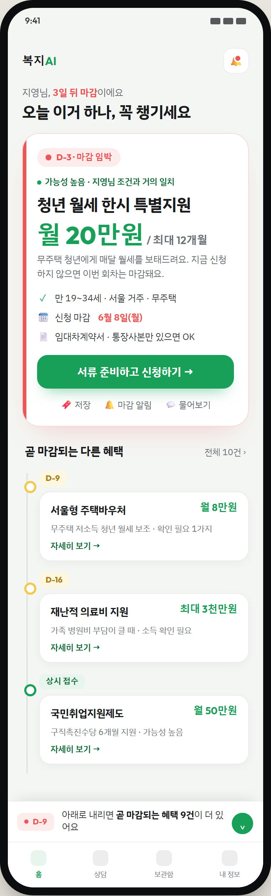
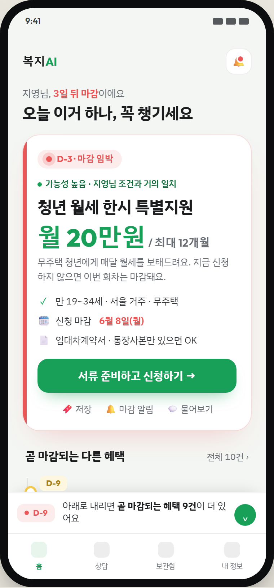
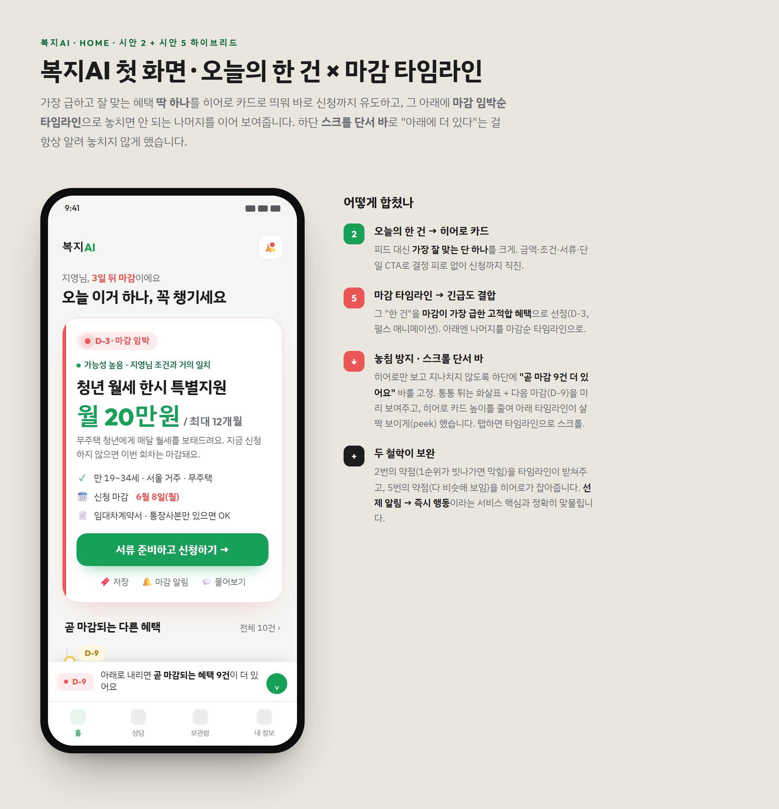

# bokji-ai · 홈(첫 화면) 디자인 명세서

> 앱 이름: **bokji-ai** · 화면: 홈(첫 진입) · 플랫폼: 모바일 PWA (기준 360×812)
> 컨셉: **오늘의 한 건(시안 2) × 마감 타임라인(시안 5) 하이브리드**
> 최종 업데이트: 2026-06-05

---

## 1. 화면 목적

bokji-ai에 진입한 사용자가 **"지금 당장 무엇을 해야 하는지"** 를 0초 만에 알게 한다.
수십 개의 추천을 나열해 결정 피로를 주는 대신, **가장 급하고 잘 맞는 단 하나**를 크게 보여 신청까지 직진시키고,
그 뒤로 **마감 임박순 타임라인**을 이어 붙여 "선제 알림 → 즉시 행동"이라는 서비스 핵심 가치(PRD 2장)를 화면으로 구현한다.

---

## 2. 디자인 컨셉

| 출처 | 가져온 것 | 역할 |
|------|----------|------|
| **시안 2 · 오늘의 한 건** | 단일 히어로 카드(혜택명·금액·조건·서류·단일 CTA) | 결정 피로 제거, 신청 전환 |
| **시안 5 · 마감 타임라인** | 마감 임박순 수직 타임라인, 긴급도 색상 | 놓치면 안 되는 것 우선 노출 |
| **결합 규칙** | 히어로 = *마감이 가장 급한 고적합 혜택* (긴급도 ∩ 적합도) | 두 시안의 약점 상호 보완 |

- 시안 2의 약점(1순위 추천이 빗나가면 막힘) → **타임라인**이 대안을 받쳐줌
- 시안 5의 약점(항목이 다 비슷해 보임) → **히어로 카드**가 "오늘 할 일"을 명확히 잡아줌

---

## 3. 전체 화면

전체 스크롤 펼친 모습 / 첫 진입 시 보이는 영역(스크롤 단서 포함):





설계 의도 주석본:



> 인터랙티브 원본: [`docs/design-mockups/home-hybrid.html`](../design-mockups/home-hybrid.html)
> 재현: `node docs/design-mockups/render-hybrid.mjs`

---

## 4. 화면 구조 (위 → 아래)

```
┌─────────────────────────────┐
│ Status bar                   │
├─────────────────────────────┤
│ ① 헤더    bokji-ai      🔔(뱃지) │  AppHeader
├─────────────────────────────┤
│ ② 인사/맥락                   │  GreetingLine
│   "지영님, 3일 뒤 마감이에요"   │
│   "오늘 이거 하나, 꼭 챙기세요" │
├─────────────────────────────┤
│ ③ 히어로 카드 (오늘의 한 건)    │  HeroBenefitCard
│   [D-3·마감 임박] (펄스)       │
│   가능성 높음 · 조건 일치       │
│   청년 월세 한시 특별지원       │
│   월 20만원 / 최대 12개월      │
│   조건 · 마감일 · 서류          │
│   [서류 준비하고 신청하기 →]    │
│   저장 · 마감알림 · 물어보기    │
├─────────────────────────────┤
│ ④ "곧 마감되는 다른 혜택" ▒▒   │  DeadlineTimeline (peek)
│    D-9 서울형 주택바우처 …      │  ← 헤더가 살짝 보임(peek)
│                                │
├─────────────────────────────┤
│ ⑤ 스크롤 단서 바 (고정)        │  ScrollCueBar  ★핵심
│   ● D-9  곧 마감 9건 더…  (⌄) │
├─────────────────────────────┤
│ ⑥ 하단 탭  홈 상담 보관함 내정보 │  BottomNav (→ app-screens.md)
└─────────────────────────────┘
```

---

## 5. ★ 놓침 방지 UI — 스크롤 단서 (핵심 요구사항)

히어로 카드만 보고 **"곧 마감되는 다른 혜택"의 존재를 모른 채 지나치는 것**을 막기 위해 **이중 단서**를 둔다.

| 단서 | 구현 | 효과 |
|------|------|------|
| **A. 콘텐츠 peek** | 히어로 카드 높이를 줄여 첫 진입 화면에 "곧 마감되는 다른 혜택" 섹션 헤더 + 첫 타임라인 점(D-9)이 **살짝 보이게** 함 | "잘리지 않고 이어진다"는 시각 신호 |
| **B. 고정 스크롤 단서 바** | 하단 탭 위에 항상 고정. `● D-9` + "곧 마감되는 혜택 **9건** 더 있어요" + **통통 튀는 ⌄ 화살표** | 명시적 안내 + 다음 마감 미리보기 |

**동작**
- 단서 바 탭 → 타임라인 영역으로 부드럽게 스크롤(`scroll-into-view`).
- 사용자가 스크롤해 타임라인이 뷰포트에 들어오면 단서 바는 **자동 숨김**(역할 종료). 다시 위로 올리면 재노출.
- 화살표 모션: `@keyframes bob` 1.5s 무한 반복(±3px). `prefers-reduced-motion` 시 정지.

> 두 단서를 함께 쓰는 이유: peek은 은근한 신호라 시니어가 놓칠 수 있고, 단서 바는 명시적이라 확실하다. 접근성과 발견성을 모두 확보한다.

---

## 6. 컴포넌트 분해 & Next.js 매핑

| 컴포넌트 | 책임 | props(요지) | 비고 |
|----------|------|-------------|------|
| `AppHeader` | 로고·알림 진입 | `unreadCount` | 뱃지 점 = 미확인 알림 |
| `GreetingLine` | 이름·긴급 맥락 | `userName`, `topDeadlineDday` | 카피는 D-day에 따라 가변 |
| `HeroBenefitCard` | 오늘의 한 건 | `benefit`, `urgency`, `fitLevel` | 메인 CTA 포함 |
| `UrgencyBadge` | D-day·마감 강도 | `dday`, `level` | 펄스 애니메이션 |
| `FitTag` | 적합도 | `level: 높음\|확인필요\|낮음` | PRD 3.2 적합도 |
| `DeadlineTimeline` | 마감순 리스트 | `items[]` | 점·라인 + 카드 |
| `TimelineItem` | 개별 혜택 | `benefit`, `dday` | 금액 우측 정렬 |
| `ScrollCueBar` | 놓침 방지 단서 | `remainingCount`, `nextDday`, `onTap` | IntersectionObserver로 자동 숨김 |
| `BottomNav` | 전역 탭 | `active` | 홈/상담/보관함/내 정보 (알림은 헤더 🔔). 상세 [app-screens.md](app-screens.md) |

> 기존 `src/components/RecommendedFeed.tsx`를 이 구조로 재구성 권장. `AGENTS.md` 지침에 따라 구현 전 `node_modules/next/dist/docs/` 최신 가이드 확인.

---

## 7. 디자인 토큰

```css
:root{
  /* Surface */
  --bg-app:        #f4f6f3;   /* 홈 배경 (warm green-gray) */
  --bg-card:       #ffffff;
  --ink:           #1b1c1e;   /* 본문 */
  --muted:         #6a6f76;   /* 보조 텍스트 */
  --line:          rgba(27,28,30,.08);

  /* Brand */
  --green:         #18a058;   /* 핵심/긍정/CTA */
  --green-d:       #0f6b3a;
  --green-l:       #e8f5ec;

  /* Status (적합도·긴급도) */
  --possible:      #18a058;   /* 가능성 높음 */
  --check:         #f2c94c;   /* 확인 필요 */
  --check-d:       #a9821a;
  --urgent:        #eb5757;   /* 마감 임박 */
  --urgent-l:      #fdecec;
  --info:          #2f80ed;   /* 새 소식 */

  /* Shape */
  --r-card:        24px;
  --r-chip:        999px;
  --r-btn:         15px;

  /* Elevation */
  --sh-card:       0 18px 42px -22px rgba(235,87,87,.35); /* 히어로(긴급) */
  --sh-soft:       0 4px 14px rgba(0,0,0,.04);
  --sh-cue:        0 -10px 22px -14px rgba(0,0,0,.18);    /* 단서 바 상단 */
}
```

- **타이포**: 헤드라인/숫자 `Outfit`, 본문 `IBM Plex Sans KR`. 금액은 항상 `Outfit 800`로 강조.
- **긴급도 색 규칙**: D-3 이하 = `--urgent`(코랄+펄스), D-4~14 = `--check`(옐로), 그 외/상시 = `--green`.

---

## 8. 화면 상태(States)

| 상태 | 처리 |
|------|------|
| 기본 | 위 명세 그대로 |
| **추천 0건** | 히어로 자리에 "아직 딱 맞는 혜택을 찾고 있어요" + 프로필 보완/상담 유도 CTA. 단서 바·타임라인 숨김 |
| **마감 임박 없음** | 히어로 배지를 `가능성 높음`(그린)으로, 단서 바 카피 "추천 N건 더 보기" |
| **로딩** | 히어로/타임라인 스켈레톤(라운드 동일) |
| **오프라인/동기화 실패** | 마지막 저장 데이터로 표시 + 상단 안내 배너(PRD 비기능 요구 운영성) |

---

## 9. 인터랙션 & 모션

- 히어로 `D-3` 배지: 코랄 펄스(`box-shadow` 확산) 1.6s.
- 스크롤 단서 화살표: 상하 bob 1.5s.
- 카드 탭: `scale(.98)` + 그림자 축소(150ms).
- CTA: 누름 시 살짝 가라앉음, 성공 시 체크 마이크로 애니메이션.
- **모든 모션은 `@media (prefers-reduced-motion: reduce)`에서 비활성화.**

---

## 10. 접근성 (PRD 비기능 요구 반영)

- 본문 최소 13px, 히어로 핵심 정보 22px+ / 명도 대비 AA 이상.
- 터치 타깃 ≥ 44×44 (CTA·탭·단서 바).
- "수급 확정" 단정 표현 금지 → "가능성 높음 / 확인 필요"만 사용(PRD 4·비기능).
- 색만으로 정보 전달 금지: 긴급도는 색 + 텍스트(`D-3·마감 임박`) 병기.
- 큰 글씨 모드·스크린리더 라벨(`aria-label`) 제공. 단서 바는 `role="button"`.

---

## 11. 데이터 매핑 (PRD 연계)

| 화면 요소 | 출처 데이터 |
|-----------|------------|
| 히어로 선정 | 적합도(가능성 높음) ∩ 최소 D-day → 1건 |
| 금액/조건/서류/마감 | 공고 + AI 쉬운 말 요약(PRD 3.3) |
| 적합도 태그 | 개인 조건 기반 매칭(PRD 3.1·3.2) |
| 타임라인 정렬 | 마감일 오름차순, 상시는 하단 |
| 단서 바 카운트 | 타임라인 총 건수 − 1(히어로) |
| 알림 뱃지 | 문자/이메일 알림 미확인 수(PRD 3.4) |

---

## 12. 에셋 & 재현

| 항목 | 경로 |
|------|------|
| 인터랙티브 시안(HTML) | `docs/design-mockups/home-hybrid.html` |
| 렌더 스크립트 | `docs/design-mockups/render-hybrid.mjs` |
| 전체 스크린샷 | `docs/design-mockups/screenshots/home-hybrid-tall.png` |
| 첫 진입 스크린샷 | `docs/design-mockups/screenshots/home-hybrid-phone.png` |
| 주석본 | `docs/design-mockups/screenshots/home-hybrid-full.png` |
| 5종 비교 시안 | `docs/design-mockups/home-mockups.html` |

```bash
# 스크린샷 재생성
node docs/design-mockups/render-hybrid.mjs
```
