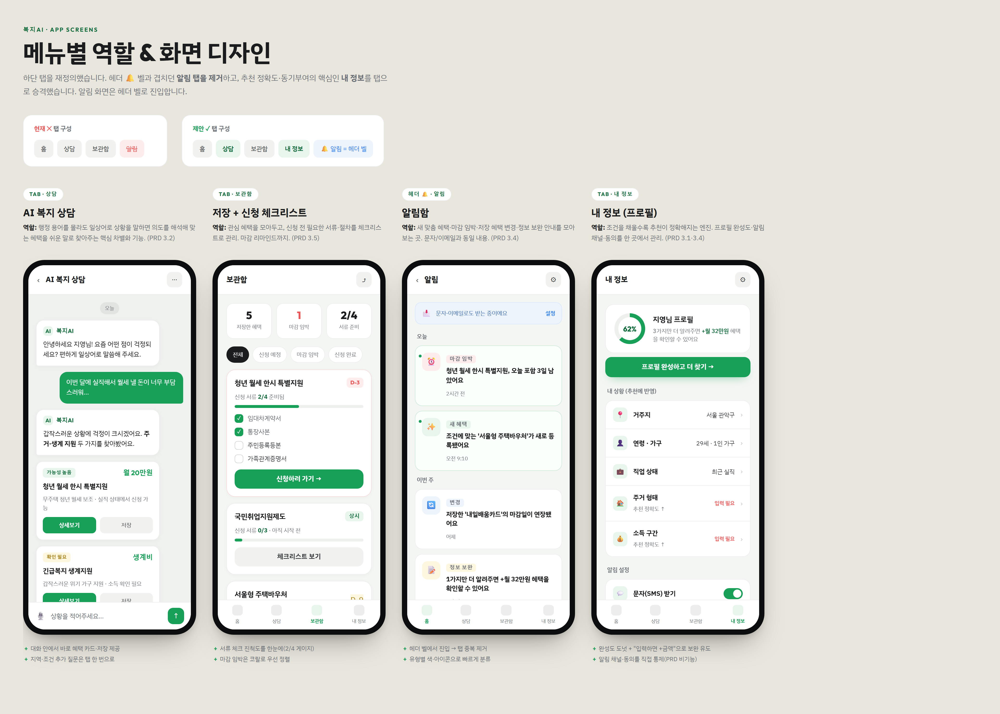

# 🟢 복지AI 프로젝트 안내 (팀원용)

> **한 줄 소개**
> 복지AI는 *"어려운 복지 정보를 대신 찾아서, 쉬운 말로 설명하고, 놓치지 않게 알려주는"* 모바일 앱입니다.
> 한마디로 **복지 통역사 + 개인 알림 비서**예요.

> 📅 기준일: 2026-06-09 · 작성: 개발 진행 상황 공유용 · 비전공자 눈높이 버전

---

## 🎯 우리가 만드는 게 뭐예요?

정부 복지 혜택은 **수만 개**가 있지만, 문제는 이거예요:

- 어디서 찾아야 할지 모른다 😵‍💫
- 찾아도 **용어가 너무 어렵다** (중위소득? 소득인정액?)
- 신청 **마감일을 놓친다** ⏰

복지AI는 사용자가 **"퇴사해서 월세가 부담돼"** 처럼 평소 말로 이야기하면,
관련 혜택을 찾아 **쉬운 말로 설명**하고 **마감 전에 알려줍니다.**

---

## 🧩 프로그램은 어떻게 돌아가나요? (쉬운 비유)

복지AI는 크게 **3개의 부품**으로 되어 있어요. 식당에 비유하면:

| 부품 | 하는 일 | 비유 |
|------|---------|------|
| **① 데이터 수집** | 정부 사이트에서 복지 정보를 매일 가져와 우리 창고에 저장 | 🛒 매일 시장에서 장보기 |
| **② 정리·분류** | 각 혜택에 "지역·나이·가구·주제" 라벨을 붙여 정리 | 🏷️ 재료를 종류별로 진열 |
| **③ AI 상담** | 사용자 질문에 맞는 혜택만 골라 AI가 쉽게 설명 | 👩‍🍳 주문 받고 요리해서 내주기 |

> 💡 **핵심 아이디어**
> 사용자가 물어볼 때마다 정부 사이트에 직접 전화하는 게 아니라,
> **미리 정보를 다 모아 정리해 두고**, 우리 창고에서 빠르게 찾아줍니다.
> → 그래서 **빠르고**, 정부 사이트가 멈춰도 **안 끊깁니다.**

---

## ✅ 지금까지 한 일

- [x] **복지 데이터 16,000건 수집 완료**
  - 복지로(중앙부처) 448건 + 복지로(지자체) 4,561건 + 정부24 10,962건 = **15,971건**
  - 매일 자동으로 최신화되도록 구성
- [x] **혜택마다 라벨(분류) 붙이기 완료**
  - 지역(시/도·시/군/구), 생애주기(청년·노년 등), 가구유형(저소득·한부모 등), 관심주제(주거·의료 등)
  - → 사용자 상황에 딱 맞는 혜택을 **정확히 걸러낼 수 있게** 됨
- [x] **검색 + AI 상담 연결 완료**
  - 사용자가 "월세가 부담돼"라고 하면 → 관련 단어를 알아듣고(동의어 사전) → 맞는 혜택만 추려서 → AI가 설명
- [x] **UI 디자인(화면) 확정** (아래 첨부 👇)

### ⚠️ 지금 막혀 있는 것 (딱 하나)

> AI 엔진(Google Gemini)의 **사용 크레딧(이용료)이 소진**되어, 실제 AI 답변 생성만 잠시 멈춰 있어요.
> **프로그램 코드는 완성**되어 있고, 크레딧만 충전하면 바로 작동합니다. 💳

---

## 📱 이렇게 생겼어요 (확정 UI 디자인)

앱 이름은 **복지AI**, 화면은 모바일(휴대폰) 기준으로 디자인했습니다.

### 홈 화면 — "오늘 챙길 한 건"을 가장 크게

복잡하게 수십 개를 늘어놓지 않고, **가장 급하고 잘 맞는 혜택 딱 하나**를 크게 보여줘서
바로 신청까지 이어지게 했어요. 그 아래로 **마감 임박 순서**로 다른 혜택이 이어집니다.

| 첫 화면 | 전체 모습 |
|---------|-----------|
|  |  |

> 🔑 **놓침 방지 장치**
> 화면 아래에 *"곧 마감되는 혜택 9건 더 있어요 ⌄"* 라는 안내 바를 항상 띄워서,
> 사용자가 위쪽만 보고 **다른 혜택을 못 보고 지나치는 일을 막았습니다.**

### 전체 화면 구성 (5개)

홈 · 상담(채팅) · 보관함 · 내 정보 · 알림 화면으로 구성됩니다.

---

## 🎨 디자인은 어떻게 만들었나요?

전문 디자인 툴(포토샵·피그마) 대신, **개발자가 코드로 직접 화면을 그리는 방식**으로 만들었어요.
그래서 디자인이 곧 실제 화면과 거의 같고, 수정·재사용이 쉽습니다.

| 단계 | 사용한 것 | 쉽게 말하면 |
|------|-----------|-------------|
| **1. 디자인 규칙 정하기** | 디자인 토큰 (색·글꼴·둥근 모서리 규칙) | 🎨 "초록은 이 색, 글꼴은 이거" 팔레트를 먼저 확정 |
| **2. 화면 그리기** | HTML + CSS (웹페이지를 만드는 코드) | ✏️ 코드로 실제 화면 모양을 직접 그림 |
| **3. 여러 시안 비교** | 5가지 디자인 후보 제작 후 1개 선정 | 🗳️ 후보를 만들어 보고 가장 좋은 걸 채택 |
| **4. 이미지로 캡처** | Playwright (자동 브라우저 도구) | 📸 화면을 자동으로 똑같이 찍어 이미지로 공유 |

> 💡 **왜 이렇게 했나요?**
> 코드로 디자인하면 → 그대로 **진짜 앱 화면으로 바로 연결**할 수 있어요.
> 디자인과 개발 사이에 "옮기는 작업"이 줄어서 더 빠르고 정확합니다.

**디자인 컨셉:** "오늘의 한 건"(결정 피로 줄이기) + "마감 타임라인"(놓치지 않기)을 합친 하이브리드.
시니어·정보 취약계층도 쓰기 쉽게 **큰 글씨, 큰 버튼, 쉬운 문구, 색만이 아닌 글자 병기**를 원칙으로 했어요.

---

## 🛠️ 어떤 기술로 만들고 있나요? (가볍게)

> 깊은 설명은 생략하고, "이런 도구를 쓴다" 정도만 정리했어요.

- **화면/앱:** Next.js + React (요즘 많이 쓰는 웹앱 제작 도구), 모바일 웹앱(PWA) 형태
- **데이터 저장:** Supabase (인터넷 데이터베이스)
- **AI:** Google Gemini (질문 이해 + 쉬운 말 설명)
- **디자인:** HTML/CSS + Playwright(자동 캡처)

---

## 🚀 앞으로 할 일

- [ ] **Gemini 크레딧 충전** → 실제 AI 상담 작동 확인 (가장 먼저!)
- [ ] **검색 정확도 더 올리기** — 동의어 사전 확장 + 의미 검색 추가
- [ ] **회원가입 / 내 프로필 저장** 기능 연결
- [ ] **혜택을 쉬운 말로 자동 요약**하는 기능
- [ ] **문자·이메일 알림** 발송 기능
- [ ] **관리자 검수 화면** (직원이 내용 확인·수정)

> 현재는 **"데이터 + 검색 + 화면 디자인"** 까지 완성된 단계예요.
> 비유하면 — 식당의 **재료 준비와 메뉴판·인테리어는 끝났고, 이제 주방을 본격 가동**하는 단계입니다. 🍳

---

## ❓ 자주 나올 질문

> **Q. AI가 "너는 이 혜택 받을 수 있어"라고 단정하나요?**
> 아니요. "**가능성이 높아요 / 확인이 필요해요**"처럼 안전하게 안내합니다. (잘못된 확정은 책임 문제가 됩니다)

> **Q. 개인정보는 안전한가요?**
> 민감 정보(주민번호·금융 등)는 받지 않고, 추천에 꼭 필요한 최소 정보만 다룹니다.

> **Q. 정보가 오래된 거 아니에요?**
> 매일 자동으로 정부 데이터를 다시 가져와 최신 상태를 유지합니다.

---

*이 문서는 개발 진행 상황 공유용입니다. 궁금한 점은 언제든 개발 담당에게 물어봐 주세요! 🙌*
